# [kubernetes release logos](https://github.com/kubernetes/sig-release/tree/master/releases)

Every Kubernetes minor release logo, newest first. Click a thumbnail to open the full-resolution original.

The gallery below is generated from [`logos.tsv`](logos.tsv) by [`scripts/gen_gallery.py`](scripts/gen_gallery.py). Edit the TSV, not this section.

<!-- gallery:start -->
<table>
  <tr>
    <td align="center" width="33%"> <b>v1.37</b> Garhwal</td>
    <td align="center" width="33%"><a href="logos/v1.36.svg">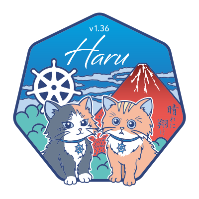</a> <b>v1.36</b> Haru</td>
    <td align="center" width="33%"><a href="logos/v1.35.svg">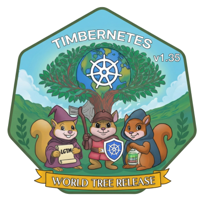</a> <b>v1.35</b> Timbernetes</td>
  </tr>
  <tr>
    <td align="center" width="33%"><a href="logos/v1.34.png">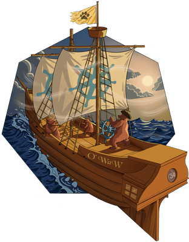</a> <b>v1.34</b> O'WaW</td>
    <td align="center" width="33%"><a href="logos/v1.33.svg">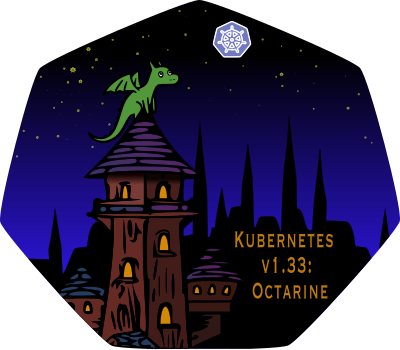</a> <b>v1.33</b> Octarine</td>
    <td align="center" width="33%"><a href="logos/v1.32.png">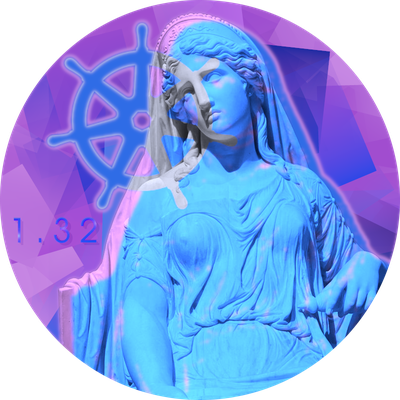</a> <b>v1.32</b> Penelope</td>
  </tr>
  <tr>
    <td align="center" width="33%"> <b>v1.31</b> Elli</td>
    <td align="center" width="33%"><a href="logos/v1.30.png">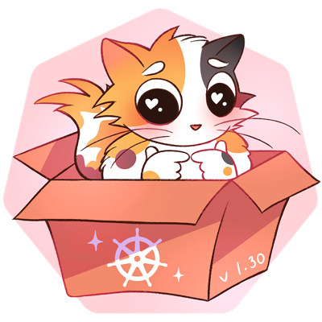</a> <b>v1.30</b> Uwubernetes</td>
    <td align="center" width="33%"> <b>v1.29</b> Mandala</td>
  </tr>
  <tr>
    <td align="center" width="33%"><a href="logos/v1.28.png">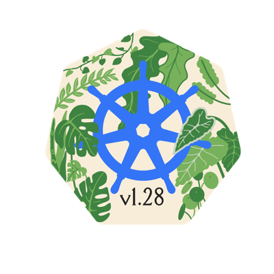</a> <b>v1.28</b> Planternetes</td>
    <td align="center" width="33%"> <b>v1.27</b> Chill Vibes</td>
    <td align="center" width="33%"><a href="logos/v1.26.png">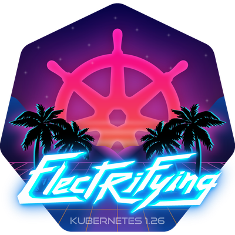</a> <b>v1.26</b> Electrifying</td>
  </tr>
  <tr>
    <td align="center" width="33%"><a href="logos/v1.25.png">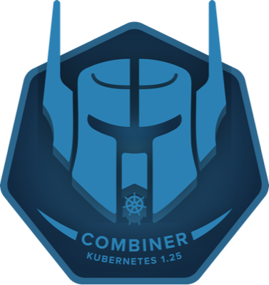</a> <b>v1.25</b> Combiner</td>
    <td align="center" width="33%"> <b>v1.24</b> Stargazer</td>
    <td align="center" width="33%"><a href="logos/v1.23.png">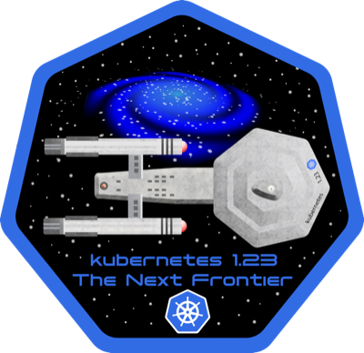</a> <b>v1.23</b> The Next Frontier</td>
  </tr>
  <tr>
    <td align="center" width="33%"><a href="logos/v1.22.png">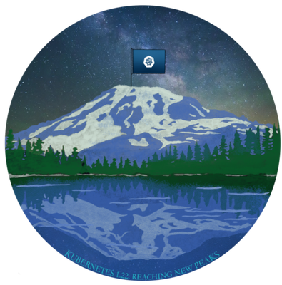</a> <b>v1.22</b> Reaching New Peaks</td>
    <td align="center" width="33%"> <b>v1.21</b> Power to the Community</td>
    <td align="center" width="33%"><a href="logos/v1.20.png">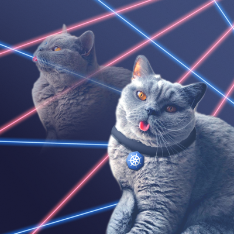</a> <b>v1.20</b> The Raddest Release</td>
  </tr>
  <tr>
    <td align="center" width="33%"><a href="logos/v1.19.png">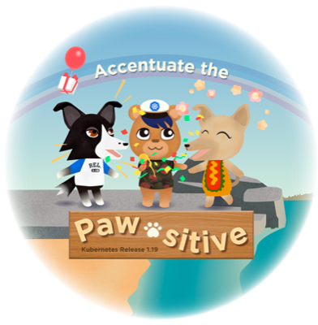</a> <b>v1.19</b> Accentuate The Paw-sitive</td>
    <td align="center" width="33%"><a href="logos/v1.18.png">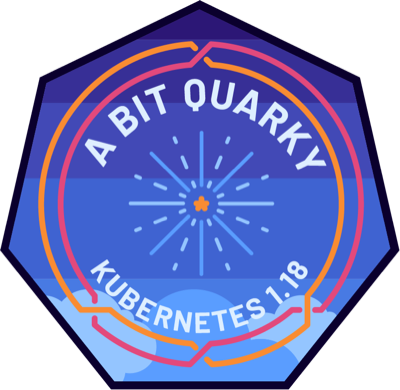</a> <b>v1.18</b> A Bit Quarky</td>
    <td align="center" width="33%"> <b>v1.17</b> The Chillest Release</td>
  </tr>
  <tr>
    <td align="center" width="33%"><a href="logos/v1.16.png">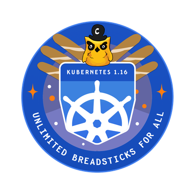</a> <b>v1.16</b> Unlimited Breadsticks For All</td>
    <td align="center" width="33%"><a href="logos/v1.15.jpeg">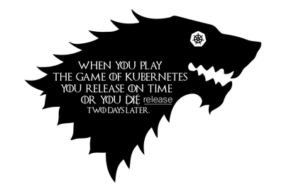</a> <b>v1.15</b> The Persevering Release</td>
    <td align="center" width="33%"><a href="logos/v1.14.jpeg">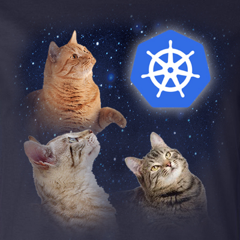</a> <b>v1.14</b> Caturnetes</td>
  </tr>
  <tr>
    <td align="center" width="33%"> <b>v1.13</b> Angel Release</td>
    <td align="center" width="33%"><a href="logos/v1.12.png">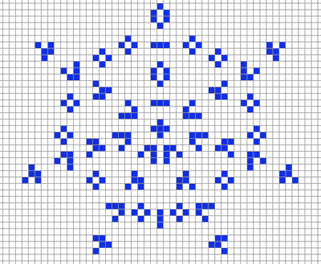</a> <b>v1.12</b> A next iteration in the evolving stable distributed system</td>
    <td align="center" width="33%"><a href="logos/v1.11.png">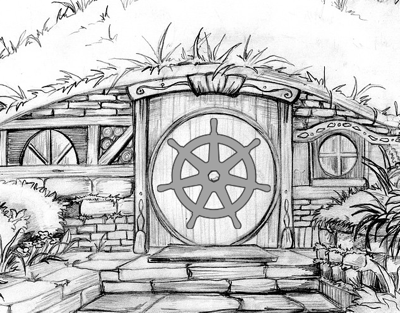</a> <b>v1.11</b> Eleventy-One: A Long-Expected Release</td>
  </tr>
  <tr>
    <td align="center" width="33%"><a href="logos/v1.10.png">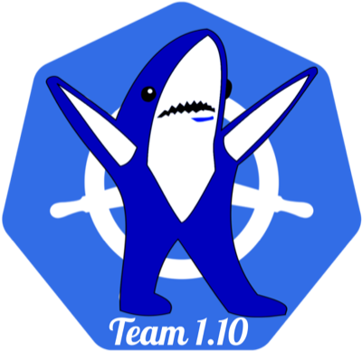</a> <b>v1.10</b> Left Shark</td>
    <td align="center" width="33%"></td>
    <td align="center" width="33%"></td>
  </tr>
</table>
<!-- gallery:end -->
